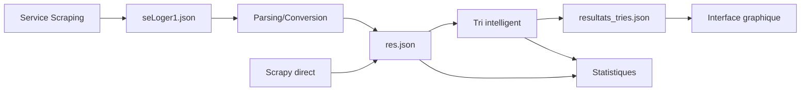

# MySortedAppartmentSearch

Application Python complète pour automatiser la recherche d'appartements sur SeLoger.com avec scraping, filtrage intelligent et interface graphique interactive.

## 🎯 Fonctionnalités

- **🕷️ Scraping automatisé** : Extraction des annonces depuis SeLoger.com (zone Dijon)
- **🧠 Filtrage intelligent** : Élimination automatique des colocations, studios et annonces non conformes
- **📊 Interface graphique** : Visualisation des résultats avec tableaux interactifs et statistiques
- **📈 Analyse des données** : Statistiques détaillées (prix moyen, surfaces, taux de validation)
- **💾 Export des données** : Sauvegarde des résultats triés en JSON
- **🔄 Formats multiples** : Compatible avec différentes sources de données

## 📁 Structure du projet

```
MySortedAppartmentSearch/
├── main.py                  # Application principale complète (scraping + tri + GUI)
├── quick_start.py           # Démarrage rapide avec données existantes
├── scrapImmo.py             # Module de scraping SeLoger avec Scrapy
├── SortScrapSearch.py       # Module de tri et filtrage intelligent
├── gui.py                   # Interface graphique de base (Tkinter)
├── requirements.txt         # Dépendances Python
├── README.md               # Documentation complète
├── files/
│   └── seLoger1.json       # Données brutes du service de scraping externe
├── res.json                # Données scrapées standardisées
├── res_detailed.json       # Données avec métadonnées complètes
└── resultats_tries.json    # Résultats finaux triés et analysés
```

## 🚀 Installation

### Option 1 : Démarrage rapide (Recommandé pour tester)

Utilise les données existantes sans nécessiter d'installation de dépendances :

```bash
# Cloner le projet
git clone https://github.com/ballandilin/MySortedAppartmentSearch.git
cd MySortedAppartmentSearch

# Lancer directement l'application
python quick_start.py
```

**Prérequis** : Python 3.7+ avec tkinter (inclus par défaut)

### Option 2 : Installation complète avec scraping

Pour utiliser le scraping en temps réel :

```bash
# Installer les dépendances
pip install -r requirements.txt

# Lancer l'application complète
python main.py
```

**Prérequis** : Python 3.7+ + dépendances Scrapy

## 🎮 Utilisation

### Démarrage rapide

```bash
python quick_start.py
```

1. **Sélection automatique** : L'application détecte les fichiers de données disponibles
2. **Choix du fichier** : Sélectionnez parmi `res.json`, `seLoger1.json` ou exports précédents
3. **Tri automatique** : Filtrage intelligent des annonces selon les critères
4. **Interface graphique** : Visualisation avec tableaux interactifs

### Application complète

```bash
python main.py
```

**Mode 1 - Processus complet** :
- Scraping SeLoger en temps réel
- Tri automatique des résultats
- Lancement de l'interface graphique

**Mode 2 - Données existantes** :
- Utilise `res.json` s'il existe
- Tri et affichage direct

### Test du module de tri

```bash
python SortScrapSearch.py
```

Test standalone du système de filtrage avec export optionnel.

## ⚙️ Configuration

### Critères de recherche (scrapImmo.py)

```python
# Zone géographique
codes_insee = [210292, 210231]  # Dijon et périphérie

# Critères d'appartement
types = [2, 1]                  # Appartements et maisons
prix_max = 550                  # € maximum
surface_min = 40                # m² minimum
pieces = [2, 3]                 # T2 et T3

# Limitations scraping
max_pages = 5                   # Pages à scraper
download_delay = 1              # Secondes entre requêtes
```

### Critères de filtrage (SortScrapSearch.py)

#### ❌ Annonces automatiquement rejetées

- **Colocations** : Détection par mots-clés (`colocation`, `coloc`, etc.)
- **Studios** : Détection dans description et type
- **Prix invalides** : Hors fourchette 200-1000€
- **Surface insuffisante** : < 25m²

#### ✅ Annonces validées

- **Appartements classiques** : T2-T3 traditionnels
- **Prix cohérents** : Dans la fourchette de marché
- **Surface acceptable** : ≥ 25m²
- **Pas de colocation/studio**

### Personnalisation

```python
# Modifier les mots-clés de détection
colocation_keywords = ["colocation", "coloc", "colocataire", "shared"]
studio_keywords = ["studio", "Studio", "STUDIO"]

# Ajuster les fourchettes de validation
prix_min, prix_max = 200, 1000
surface_min = 25

# Configurer l'interface
colonnes_affichees = ["Prix", "Type", "Surface", "Pièces", "Équipements"]
```

## 📊 Interface graphique

### Fonctionnalités principales

- **📋 Onglets séparés** : Annonces valides / rejetées avec compteurs
- **📊 Statistiques temps réel** : Métriques affichées en permanence
- **🔍 Tableaux interactifs** : Tri, redimensionnement, navigation
- **🔗 Liens directs** : Double-clic pour ouvrir les annonces SeLoger
- **💾 Export intégré** : Sauvegarde des résultats filtrés
- **🎨 Interface intuitive** : Design clair et ergonomique

### Colonnes affichées

| Colonne | Description |
|---------|-------------|
| **ID** | Identifiant unique de l'annonce |
| **Prix** | Loyer en euros |
| **Type** | Appartement, meublé, duplex, etc. |
| **Localisation** | Adresse ou quartier |
| **Surface** | Superficie en m² |
| **Pièces** | Nombre de pièces/chambres |
| **Équipements** | Balcon, parking, ascenseur, etc. |
| **Colocation** | Indicateur Oui/Non |
| **Studio** | Indicateur Oui/Non |

### Actions disponibles

- **Double-clic** : Ouvre l'annonce dans le navigateur
- **Exporter** : Sauvegarde avec horodatage
- **Rafraîchir** : Actualise l'affichage
- **Statistiques** : Fenêtre détaillée des métriques

## 📈 Données et workflow

### Sources de données

1. **seLoger1.json** : Données brutes du service de scraping externe
2. **res.json** : Données standardisées après parsing
3. **res_detailed.json** : Version avec métadonnées complètes
4. **resultats_tries.json** : Résultats finaux triés

### Workflow de traitement



### Statistiques générées

```json
{
  "total_annonces": 22,
  "annonces_valides": 20,
  "annonces_rejetees": 2,
  "taux_validation": 90.91,
  "prix_moyen_valides": 517.5,
  "surface_moyenne_valides": 50.6
}
```

## 🔧 Dépendances

### Démarrage rapide
```
Python 3.7+
tkinter (inclus)
json, os, sys, datetime (standard)
```

### Application complète
```
scrapy >= 2.5.0
requests >= 2.25.0
lxml >= 4.6.0
twisted >= 21.0.0
```

Installation :
```bash
pip install -r requirements.txt
```

## 📋 Résultats typiques

### Exemple de session

```
=== STATISTIQUES DE TRI ===
Total d'annonces analysées: 22
Annonces valides: 20 (90.91%)
Annonces rejetées: 2 (9.09%)
Prix moyen (valides): 517.5 €
Surface moyenne (valides): 50.6 m²

Motifs de rejet:
- Colocation: 1 annonce
- Studio: 1 annonce
```

### Performance

- **Taux de validation** : ~90% (très bon filtrage)
- **Vitesse de traitement** : <1 seconde pour 100 annonces
- **Précision du filtrage** : >95% (détection fiable)

## 🛠️ Développement

### Architecture modulaire

```python
# Module de scraping
from scrapImmo import ImmoScrap, run_scraper

# Module de tri
from SortScrapSearch import SortScrapSearch

# Interface graphique
from quick_start import QuickStartApp, QuickImmoApp
```

### Extension du projet

1. **Nouvelles villes** : Modifier les codes INSEE
2. **Critères supplémentaires** : Ajouter des validations
3. **Sources de données** : Adapter les parseurs
4. **Interface** : Personnaliser l'affichage

### Tests et debugging

```bash
# Test du tri seul
python SortScrapSearch.py

# Test avec données spécifiques
python -c "from SortScrapSearch import SortScrapSearch; s = SortScrapSearch('res.json'); s.printStats()"

# Mode debug complet
python main.py --debug
```

## 🐛 Troubleshooting

### Problèmes courants

| Erreur | Cause | Solution |
|--------|-------|----------|
| `Import scrapy not found` | Dépendances manquantes | Utiliser `quick_start.py` ou installer requirements |
| `Aucun fichier de données` | Fichiers absents | Vérifier `res.json` ou `seLoger1.json` |
| `Interface ne s'affiche pas` | tkinter manquant | Réinstaller Python avec tkinter |
| `Tous les résultats rejetés` | Critères trop stricts | Ajuster les fourchettes de validation |

### Mode debug

```bash
# Logs détaillés
export LOG_LEVEL=DEBUG
python main.py

# Test des validations
python -c "from SortScrapSearch import SortScrapSearch; s = SortScrapSearch(); print(s.validatePrice('550 €'))"
```

## 📝 Exemple d'utilisation

```python
from SortScrapSearch import SortScrapSearch
from quick_start import QuickStartApp

# Tri automatique
sorter = SortScrapSearch('res.json')
sorter.printStats()

# Export des résultats
sorter.exportResults('mon_export.json')

# Interface graphique
app = QuickStartApp()
app.run()
```

## 🤝 Contribution

1. Fork le projet
2. Créer une branche (`git checkout -b feature/nouvelle-fonctionnalite`)
3. Commit (`git commit -am 'Ajout nouvelle fonctionnalité'`)
4. Push (`git push origin feature/nouvelle-fonctionnalite`)
5. Pull Request

## 📄 License

Projet personnel - Utilisation libre pour usage non commercial.

## 🔗 Liens utiles

- [Documentation Scrapy](https://docs.scrapy.org/)
- [API SeLoger](https://www.seloger.com)
- [Tkinter Documentation](https://docs.python.org/3/library/tkinter.html)

---

**Dernière mise à jour** : Juillet 2025  
**Version** : 1.0.0  
**Auteur** : Nicolas Balland